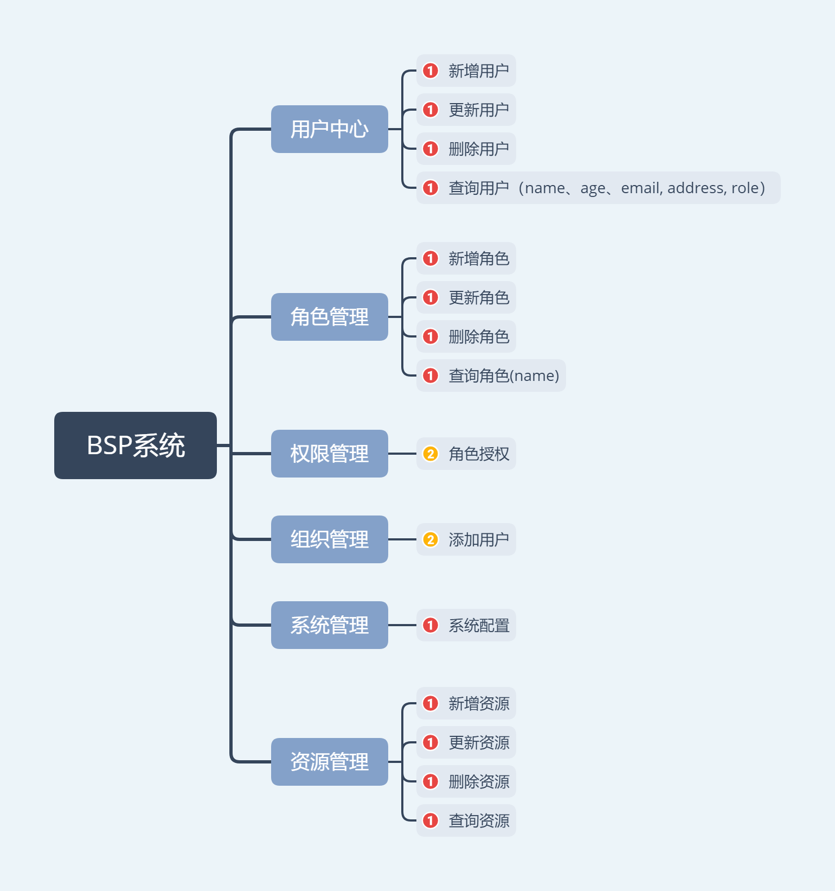

## 用戶组织权限管理系统
### 系统描述
#### 前端地址： [https://github.com/canyuegongzi/simple-user-center-web.git]()
**系统前端基于Vue +ElementUi + typeScript构建**
#### 后端地址： [https://github.com/canyuegongzi/simple-user-center.git]()
**系统后端基于node + nest.js +mysql构建**
### 系统结构

### 系统截图


### 目录说明
```
api             // 系统接口
assets          // 系统静态资源
components      // 系统静态组件
styles          // 系统样式
type            // 静态类
utils           // 工具函数
    fetch       // axios封装  
    localStorage// 本地存储 
    storage     // 本地现实存储
    tree-data   // 线性-树型数据转换
    url-params
    validate    // 校验器
views           // 视图组件
config.ts       // 系统地址配置
env.ts          // 环境变量文件
session.ts      // 系统初始化函数

```
### 系统运行
#### 前端
```
git clone https://github.com/canyuegongzi/simple-user-center-web.git
npm install
npm run serve
```
#### 后端
于congig/config.ts配置mysql redis 等全局配置
```
git clone https://github.com/canyuegongzi/simple-user-center.git
npm install
npm run start:dev
```
### 系统预览
[在线地址](http://canyuegongzi.xyz/simple-user-center-web)
#### **不要进行随意修改系统中的数据**
#### **不要进行随意修改系统中的数据**
#### **不要进行随意修改系统中的数据**
#### **不要进行随意修改系统中的数据**

